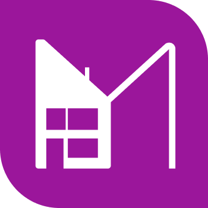
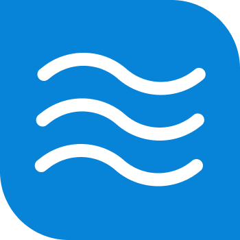

## Transport for Stepford / National Rail

| Icon | Station Code | Station Name | Folder |
| :-- | :-- | :-- | :-- |
|  | SVC | Stepford Victoria | [`src/stations/SVC`](./src/stations/SVC) |
|  | SCN | Stepford Central | [`src/stations/SCN`](./src/stations/SCN) |
|  | SCE | Stepford East | [`src/stations/SCE`](./src/stations/SCE) |
|  | SHB | St. Helens Bridge | [`src/stations/SHB`](./src/stations/SHB) |
|  | BEN | Benton | [`src/stations/BEN`](./src/stations/BEN) |
|  | MGT | Morganstown | [`src/stations/MGT`](./src/stations/MGT) |
|  | LTC | Leighton City | [`src/stations/LTC`](./src/stations/LTC) |
|  | LYN | Llyn-by-the-Sea | [`src/stations/LYN`](./src/stations/LYN) |

## Stepford Connect

| Icon | Station Code | Station Name | Folder |
| :-- | :-- | :-- | :-- |
|  | WHL | Woodhead Lane | [`src/stations/WHL`](./src/stations/WHL) |
|  | HTR | Houghton Rake | [`src/stations/HTR`](./src/stations/HTR) |
|  | WHF | Whitefield | [`src/stations/WHF`](./src/stations/WHF) |
|  | PBN | Port Benton | [`src/stations/PBN`](./src/stations/PBN) |
|  | BNB | Benton Bridge | [`src/stations/BNB`](./src/stations/BNB) |
|  | HHG | Hampton Hargate | [`src/stations/HHG`](./src/stations/HHG) |
|  | USL | Upper Staploe | [`src/stations/USL`](./src/stations/USL) |
|  | WTN | Water Newton | [`src/stations/WTN`](./src/stations/WTN) |
|  | RCP | Rocket Parade | [`src/stations/RCP`](./src/stations/RCP) |
|  | LTW | Leighton West | [`src/stations/LTW`](./src/stations/LTW) |
|  | EDG | Edgemead | [`src/stations/EDG`](./src/stations/EDG) |
|  | ALB | Aslockby | [`src/stations/ALB`](./src/stations/ALB) |
|  | CLB | Carnalea Bridge | [`src/stations/CLB`](./src/stations/CLB) |
|  | RLB | Rayleigh Bay | [`src/stations/RLB`](./src/stations/RLB) |
|  | FAY | Faymere | [`src/stations/FAY`](./src/stations/FAY) |
|  | WST | Westercoast | [`src/stations/WST`](./src/stations/WST) |
|  | MRC | Millcastle Racecourse | [`src/stations/MRC`](./src/stations/MRC) |
|  | MLC | Millcastle | [`src/stations/MLC`](./src/stations/MLC) |
|  | STL | Starryloch | [`src/stations/STL`](./src/stations/STL) |

## Waterline

| Icon | Station Code | Station Name | Folder |
| :-- | :-- | :-- | :-- |
|  | NRH | Newry Harbour | [`src/stations/NRH`](./src/stations/NRH) |
|  | NRY | Newry | [`src/stations/NRY`](./src/stations/NRY) |
|  | EDQ | Eden Quay | [`src/stations/EDQ`](./src/stations/EDQ) |
|  | FRD | Faraday Road | [`src/stations/FRD`](./src/stations/FRD) |
|  | WBN | West Benton | [`src/stations/WBN`](./src/stations/WBN) |
|  | CSP | Cambridge Street Parkway | [`src/stations/CSP`](./src/stations/CSP) |
|  | APK | Ashlan Park | [`src/stations/APK`](./src/stations/APK) |
|  | CON | Connolly | [`src/stations/_CON`](./src/stations/_CON) (folders/files can't be named CON in windows) |
|  | SAW | Airport West | [`src/stations/SAW`](./src/stations/SAW) |
|  | JST | James Street | [`src/stations/JST`](./src/stations/JST) |
|  | FAR | Farleigh | [`src/stations/FAR`](./src/stations/FAR) |
|  | RDV | Rosedale Village | [`src/stations/RDV`](./src/stations/RDV) |
|  | EFD | Esterfield | [`src/stations/EFD`](./src/stations/EFD) |
|  | MGD | Morganstown Docks | [`src/stations/MGD`](./src/stations/MGD) |
|  | WNG | Whitney Green | [`src/stations/WNG`](./src/stations/WNG) |
|  | GNS | Greenslade | [`src/stations/GNS`](./src/stations/GNS) |

## Airlink

| Icon | Station Code | Station Name | Folder |
| :-- | :-- | :-- | :-- |
|  | EMJ | Elsemere Junction | [`src/stations/EMJ`](./src/stations/EMJ) |
|  | SAP | Airport Parkway | [`src/stations/SAP`](./src/stations/SAP) |
|  | SAC | Airport Central | [`src/stations/SAC`](./src/stations/SAC) |
|  | SAO | Airport Teminal 1 | [`src/stations/SAO`](./src/stations/SAO) |
|  | SAX | Airport Teminal 2 | [`src/stations/SAX`](./src/stations/SAX) |
|  | SAZ | Airport Teminal 3 | [`src/stations/SAZ`](./src/stations/SAZ) |

## Stepford Express

| Icon | Station Code | Station Name | Folder |
| :-- | :-- | :-- | :-- |
|  | LSR | Leighton Stepford Road | [`src/stations/LSR`](./src/stations/LSR) |
|  | WYV | Westwyvern | [`src/stations/WYV`](./src/stations/WYV) |
|  | NSE | Northshore | [`src/stations/NSE`](./src/stations/NSE) |

## Metro

| Icon | Station Code | Station Name | Folder |
| :-- | :-- | :-- | :-- |
|  | WFD | Willowfield | [`src/stations/WFD`](./src/stations/WFD) |
|  | HPK | Hemdon Park | [`src/stations/HPK`](./src/stations/HPK) |
|  | BCY | Beechley | [`src/stations/BCY`](./src/stations/BCY) |
|  | FNQ | Financial Quarter | [`src/stations/FNQ`](./src/stations/FNQ) |
|  | CHP | City Hospital | [`src/stations/CHP`](./src/stations/CHP) |
|  | FWY | Four Ways | [`src/stations/FWY`](./src/stations/FWY) |
|  | SHS | Stepford High Street | [`src/stations/SHS`](./src/stations/SHS) |
|  | WFL | Whitefield Lido | [`src/stations/WFL`](./src/stations/WFL) |
|  | UFC | Stepford UFC | [`src/stations/UFC`](./src/stations/UFC) |
|  | NHW | New Harrow | [`src/stations/NHW`](./src/stations/NHW) |
|  | EMP | Elsemere Pond | [`src/stations/EMP`](./src/stations/EMP) |
|  | BRY | Berrily | [`src/stations/BRY`](./src/stations/BRY) |
|  | EBR | East Berrily | [`src/stations/EBR`](./src/stations/EBR) |
|  | BPK | Beaulieu Park | [`src/stations/BPK`](./src/stations/BPK) |
|  | AGP | Angel Pass | [`src/stations/AGP`](./src/stations/AGP) |
|  | CXN | Coxly Newtown | [`src/stations/CXN`](./src/stations/CXN) |
|  | BAR | Barton | [`src/stations/BAR`](./src/stations/BAR) |
|  | BDN | Bodin | [`src/stations/BDN`](./src/stations/BDN) |
|  | CLY | Coxly | [`src/stations/CLY`](./src/stations/CLY) |
